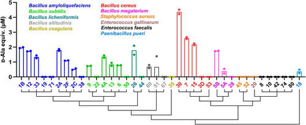
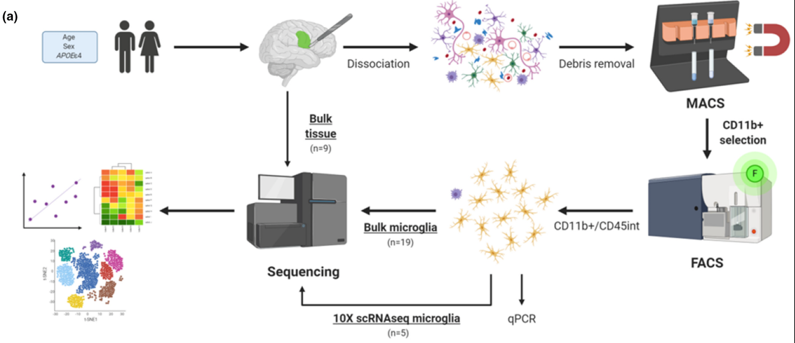
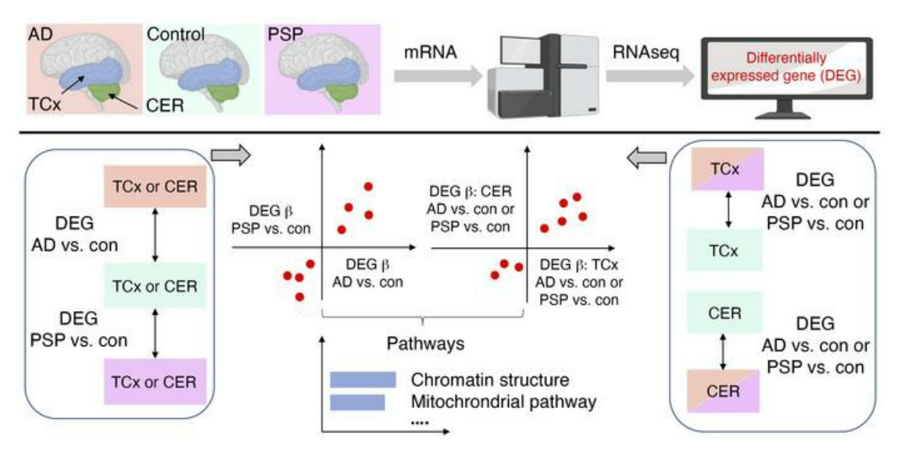
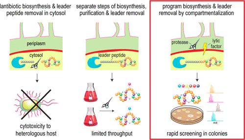
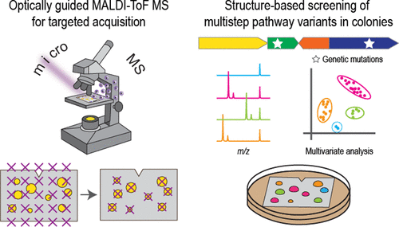
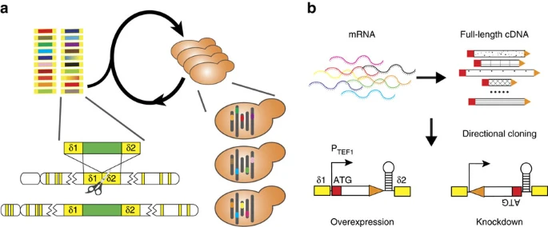

```{r, echo=FALSE}
knitr::opts_chunk$set(
  echo = FALSE,
  fig.align="center"
)
```

```{css}
.under {
  text-decoration: underline
}

.paper_title{
  font-size: 13pt;
  line-height: 1.1;
  margin-bottom: 30px;
  text-align: justify;
}
.paper_abstract{
  font-size: 10pt;
  line-height: 100%;
  text-align: justify;
}
```


## Journal Articles

1. <div class="paper_title">
Cindy J. Lee, Tian A. Qiu, Zhilai Hong, Zhenkun Zhang, <span class="under">Yuhao Min</span>, Linzixuan Zhang, Lei Dai, Huimin Zhao, Tong Si, Jonathan V. Sweedler;
**Profiling of d-alanine production by the microbial isolates of rat gut microbiota**;
*The FASEB Journal*,
**2022**
[[PubMed]](https://pubmed.ncbi.nlm.nih.gov/35816159/)
</div>

    ```{r 2022_FASEB, out.width="60%"}
    
    ```
      <div class="paper_abstract">
      We isolated D-amino acid producing bacteria strains from rat gut microbiome and characterized  the D-amino acid level using biochemical and MS-based approaches. Our analysis furthered the idea that microbial metabolites modulate host physiology.
      </div>

1. <div class="paper_title">
Tulsi A. Patel, Troy P. Carnwath, Xue Wang, Mariet Allen, Sarah J. Lincoln, Laura J. Lewis-Tuffin, Zachary S. Quickall, Shu Lin, Frederick Q. Tutor-New, Charlotte C. G. Ho, <span class="under">Yuhao Min</span>, Kimberly G. Malphrus, Thuy T. Nguyen, Elizabeth Martin, Cesar A. Garcia, Rawan M. Alkharboosh, San- jeet Grewal, Kaisorn Chaichana, Robert Wharen, Hugo Guerrero-Cazares, Alfredo Quinoes-Hinojosa, Nilüfer Ertekin-Taner;
**Transcriptional landscape of human microglia implicates age, sex, and APOE-related immunometabolic pathway perturbations**;
*Aging Cell*, 
**2022**
[[PubMed]](https://pubmed.ncbi.nlm.nih.gov/35388616/)
</div>

    ```{r 2022_aging_cell, out.width="55%"}
    
    ```
      <div class="paper_abstract">
      We characterized human microglial transcriptome at bulk-tissue and single-cell levels. We identified expression changes and pathways associated with age, sex, and APOE phenotypes
      </div>

1. <div class="paper_title">
Xue Wang, Mariet Allen, Özkan  İş, Joseph S. Reddy, Frederick Q. Tutor-New, Monica Castanedes Casey, Minerva M. Carrasquillo, Stephanie R. Oatman, <span class="under">Yuhao Min</span>, Yan W. Asmann, Cory Funk, Thuy Nguyen, Charlotte C. G. Ho, Kimberly G. Malphrus, Nicholas T. Seyfried, Allan Levey, Steven G. Younkin, Melissa E. Murray, Dennis W. Dickson, Nathan D. Price, Todd E. Golde, Nilüfer Ertekin-Taner; 
**Alzheimer’s disease and progressive supranuclear palsy share similar transcriptomic changes in distinct brain regions**; 
*The Journal of Clinical Investigation*, 
**2022**. 
[[PubMed]](https://pubmed.ncbi.nlm.nih.gov/34813500/)
</div>


    ```{r 2022_JCI, out.width="50%"}
    
    ```
      <div class="paper_abstract">
      We systematically compared the transcriptome between AD, PSP, and control subjects in two brain regions with different neuropahtology. We identified conserved gene expression perturbations among the two distinct proteinopathies that are enriched in common biological pathways.
      </div>

1. <div class="paper_title">
Tong Si, Qiqi Tian, <span class="under">Yuhao Min</span>,, Linzixuan Zhang, Jonathan V. Sweedler, Wilfred A. van der Donk, Huimin Zhao; 
**Rapid Screening of Lanthipeptide Analogs via In-Colony Removal of Leader Peptides in Escherichia coli**; 
*Journal of the American Chemical Society*, 
**2018**.
[[PubMed]](https://pubmed.ncbi.nlm.nih.gov/30183279/)
</div>

    ```{r 2018_JACS, out.width="50%"}
    
    ```
      <div class="paper_abstract">
      Here we develop a temporally programmed scheme to produce bioactive lanthipeptides within *E. coli* colony via induced autolysis. This new approach facile, high throughput discovery, characterization, and engineering of lanthipeptides and RiPPs.
      </div>

1. <div class="paper_title">
Tong Si, Bin Li, Troy J Comi, Yuwei Wu, Pingfan Hu, Yuying Wu, <span class="under">Yuhao Min</span>, Douglas A Mitchell, Huimin Zhao, Jonathan V Sweedler; 
**Profiling of Microbial Colonies for High-Throughput Engineering of Multistep Enzymatic Reactions via Optically Guided Matrix-Assisted Laser Desorption/Ionization Mass Spectrometry**; 
*Journal of the American Chemical Society*, 
**2017**.
[[PubMed]](https://pubmed.ncbi.nlm.nih.gov/28792758/)
</div>

    ```{r 2017_JACS, out.width="50%"}
    
    ```
      <div class="paper_abstract">
      We report a automated screening workflow that utilizes MALDI-ToF MS to speed up product detection in bacteria colony.The rapid screening of the bacteria can enable discovery of novel antibiotics.
      </div>


1. <div class="paper_title">
Tong Si, Ran Chao, <span class="under">Yuhao Min</span>, Yuying Wu, Wen Ren, Huimin Zhao; 
**Automated multiplex genome-scale engineering in yeast**; 
*Nature Communications*, 
**2017**. 
[[PubMed]](https://pubmed.ncbi.nlm.nih.gov/28469255/)
</div>

    ```{r 2017_nat_comm, out.width="60%"}
    
    ```
    <div class="paper_abstract">
    We developed a new platform for high-throughput genome engineering in *Saccharomyces cerevisiae*. This system enables multiplex optimization for prototypes such as acetic acid tolerance and isobutanol production.
    </div>

## Conference Presentations

1. <div class="paper_title">
<span class="under">Yuhao Min</span>, Xue Wang, Joseph S Reddy, Thuy Nguyen, Kimberly G. Malphrus, Julia E. Crook, Min- erva M. Carrasquillo, Dennis W. Dickson, Nilüfer Ertekin-Taner;
**Integrative Analysis Enables Translation of Omics Data to Molecular Targets in Progressive Supranuclear Palsy**. 
Association for Clinical and Translational Science Conference, Association for Clinical and Translational Science, **2022**
</div>

1. <div class="paper_title">
<span class="under">Yuhao Min</span>, Xue Wang, Joseph S Reddy, Thuy Nguyen, Kimberly G. Malphrus, Julia E. Crook, Minerva M. Carrasquillo, Dennis W. Dickson, Nilüfer Ertekin-Taner;
**Understanding the Transcriptional (dys)Regulation in Progressive Supranuclear Palsy**. 
Alzheimer’s Association International Conference, Alzheimer’s Association, Online, **2021**. (Poster)
</div>

1. <div class="paper_title">
<span class="under">Yuhao Min</span>, Tong Si, Huimin Zhao, 
**A Genetic Encoded System for Programmable Cell Assembly using Surface-Displayed DNA Oligonucleotides**; 
Undergraduate Research Symposium, University of Illinois at Urbana-Champaign, Urbana, IL, USA, **2016**. (Poster)
</div>
